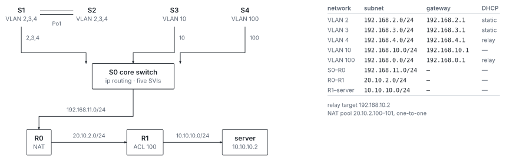

# Enterprise Network Simulation

A small enterprise network built in Cisco Packet Tracer: five VLANs behind a
layer-3 core switch, an EtherChannel-trunked access layer, RIPv2 between two
routers, NAT to an outside network, a wireless VLAN, and an ACL. The `.pkt`
topology and the exported device configurations are both here.

[](LICENSE)
[](#project-status)
[](#requirements)

## Overview



*Five VLANs behind a layer-3 core switch. Trunks carry only the VLANs they need; the core routes between them, R0 translates, R1 filters.*

The design puts every routed service in a different place on purpose, so each one
can be examined on its own:

- **Inter-VLAN routing** happens on the core switch (`S0`), not on a router — it
  runs `ip routing` with an SVI per VLAN.
- **NAT** happens on the border router (`R0`), translating the private VLAN ranges
  onto a small public pool.
- **The ACL** lives on the far router (`R1`), filtering one VLAN's HTTP access to
  one server.
- **DHCP** is relayed, not local: VLAN 4 and VLAN 100 carry `ip helper-address`
  pointing at a server in the management VLAN.
- **Link redundancy** between access switches is an EtherChannel
  (`channel-group 1 mode on`) carrying a VLAN trunk, with PVST on top.

That spread is the point of the exercise. Nothing here is large, but each service
is configured in the place it would actually live.

## Contents

```text
.
├── Enterprise_Network.pkt   # the topology — the authoritative artifact
├── config/
│   ├── Core-Switch.cfg      # S0, layer-3 core, inter-VLAN routing
│   ├── R0.cfg               # border router, NAT, RIPv2
│   ├── R1.cfg               # outside router, ACL
│   ├── S1.cfg, S2.cfg       # access switches, VLAN 2/3/4, EtherChannel
│   ├── S3.cfg               # management VLAN 10
│   └── S4.cfg               # wireless VLAN 100
├── LICENSE
└── README.md
```

After the build I audited the exported configurations line by line. `config/`
carries the corrected versions; `Enterprise_Network.pkt` keeps the topology as
built, so the two can be read side by side.

## Requirements

Cisco Packet Tracer. The `.pkt` format is version-sensitive: a file saved in a
newer release will not open in an older one.

## Usage

1. Open `Enterprise_Network.pkt` in Packet Tracer.
2. Read `config/` alongside it — the exports are much easier to diff and search
   than the GUI.
3. From a VLAN 2 host, confirm routing, inter-VLAN reachability, NAT
   translation, wireless association and ACL behaviour.

## Project Status

Complete. A finished networking study, kept as a record.

## License

Copyright 2025 Yixuan Huang

Distributed under the [MIT License](LICENSE). Cisco Packet Tracer, Cisco IOS
syntax and Cisco trademarks belong to Cisco Systems and are not covered by this
license.

## Contact

- Website: [yixuanhuang.com](https://yixuanhuang.com)
- Email: [yixnhuang@gmail.com](mailto:yixnhuang@gmail.com)
